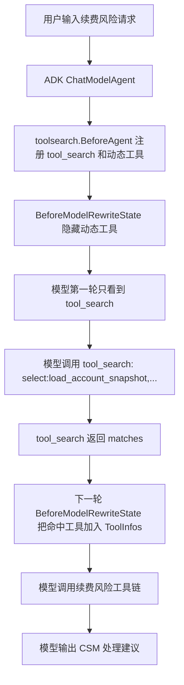

# Tool Dispatcher with Eino ADK

这个目录把“工具很多时先检索、再暴露、再调用”的 dispatcher 思路落到 Go + Eino ADK。

## 场景

非 coding demo 是“客户成功续费风险工具分诊”。

业务痛点：客户成功 Agent 面对一个续费风险客户时，工具库里可能同时有续费合同、客户健康、扩容评估、线下工作坊预约、通知外发等能力。若一开始把所有工具都塞给模型，容易带来三个问题：

- 模型上下文变重，工具描述互相干扰。
- 模型可能直接调用不该优先使用的工具，例如先预约线下工作坊，而不是先确认续费风险。
- 工具库越大，prompt 越难稳定维护。

这里用 Eino 官方 `dynamictool/toolsearch` middleware 解决：业务工具先注册到执行器，但第一轮模型只看到 `tool_search`。模型必须先搜索或选择工具，命中的工具才会在下一轮加入 `ToolInfos`，成为模型可见并可调用的工具。

## 工具库

核心续费风险工具：

- `load_account_snapshot`：读取客户健康快照、用量变化、阻塞问题和最近 CSM 动作。
- `check_renewal_contract`：读取套餐、ARR、续费窗口、决策人和发票状态。
- `draft_retention_playbook`：生成客户成功经理可执行的续费挽留方案。

刻意放入的无关工具：

- `estimate_expansion_potential`：评估扩容机会。
- `book_onsite_workshop`：预约线下工作坊。

这些无关工具模拟真实业务系统里的大工具库，证明 dispatcher 的重点不是“能不能执行工具”，而是“当前任务只把需要的工具暴露给模型”。

## 执行链路



这里要区分两层：

- `runCtx.Tools`：执行器知道有哪些工具实现，所以 ToolsNode 能跑这些工具。
- `state.ToolInfos`：模型这一轮能看到哪些工具 schema。dynamic toolsearch 控制的是这一层。

## 代码入口

- `agent.go`：创建 `RenewalRiskAgent`，把 Eino `toolsearch.New(...)` 挂到 `Handlers`。
- `tools.go`：定义续费风险工具库和确定性工具实现。
- `cmd/tool-dispatcher-agent`：命令入口，负责参数、模型创建、CozeLoop trace 和输出摘要。

## 运行

只看工具分诊摘要，不调用模型：

```bash
go run ./cmd/tool-dispatcher-agent -prepare-only
```

真实运行 ADK Agent：

```bash
go run ./cmd/tool-dispatcher-agent
```

自定义输入：

```bash
go run ./cmd/tool-dispatcher-agent -message "ACME-42 续费前用量下降，还卡着发票问题，请给 CSM 处理建议。"
```

不过这条 demo 的运行约定是：**一切以 `.env` 文件为准**。命令行参数只作为临时调试入口；如果 `.env` 里配置了同名运行项，`.env` 会覆盖命令行输入和当前进程环境变量。

`.env` 示例：

```bash
OPENAI_API_KEY=your-key
LLM_MODEL=your-model
LLM_OPENAI_BASE_URL=http://localhost:8317

TOOL_DISPATCHER_MESSAGE=客户 ACME-42 本月要续费，但最近核心功能用量下降，还卡着发票问题。请给客户成功经理一份处理建议。
TOOL_DISPATCHER_PREPARE_ONLY=false
```

模型配置从 `.env` 读取：

- `OPENAI_API_KEY`
- `LLM_MODEL` 或 `OPENAI_MODEL`
- `LLM_OPENAI_BASE_URL`、`OPENAI_BASE_URL`、`OPENAI_API_BASE`、`OPENAI_API_BASE_URL` 或 `BASE_URL`

如果 URL 没有以 `/v1` 结尾，命令会按 Eino OpenAI adapter 的约定自动补成 `/v1`，例如 `http://localhost:8317` 会使用 `http://localhost:8317/v1`。

运行输入从 `.env` 读取：

- `TOOL_DISPATCHER_MESSAGE`
- `TOOL_DISPATCHER_PREPARE_ONLY`

## Trace

命令入口用 `withRunAgentTrace` 做根 trace，只上报：

- `query_chars`
- `dynamic_tools`
- `loaded_tools`
- 最终回复字符数

它不会上传完整客户请求、工具原文或续费方案细节。若 `.env` 配置了 CozeLoop，则通过 `observability/cozeloop.InstallFromEnv` 安装官方 Eino callback；未配置时保持 disabled。

## 测试

```bash
GOCACHE=/private/tmp/ai-designing-gocache go test ./action/tool_dispatcher ./cmd/tool-dispatcher-agent -count=1
```

测试重点：

- 第一轮模型 `WithTools` 里只有 `tool_search`。
- `tool_search` 返回 matches 后，下一轮模型能看到被选中的续费风险工具。
- fake model 真实走过 `tool_search -> load_account_snapshot -> check_renewal_contract -> draft_retention_playbook -> final answer`。
- 命令级 trace 只记录摘要，不泄露客户原文或工具结果。
