## 先说结论

Claude Code 接入 MCP 的本质是：

> Claude Code 充当 MCP Client，把 MCP Server 暴露的工具转换成 Claude Code 内部统一的 `Tool`，再接入已有的权限检查和 `tool_use → tool_result` 主循环。

模型本身不直接理解 MCP，也不会直接连接 MCP Server。模型看到的仍然是 Anthropic API 的普通工具定义。

## 整体链路

```mermaid
flowchart LR
    A[".mcp.json / 用户配置 / 插件 / Claude.ai Connector"]
    B["配置合并、审批和策略过滤"]
    C["MCP SDK Client"]
    D["stdio / HTTP / SSE / WebSocket"]
    E["tools/list、prompts/list、resources/list"]
    F["转换成 Claude Code Tool"]
    G["Anthropic API tools"]
    H["模型返回 tool_use"]
    I["权限检查与 Hooks"]
    J["client.callTool()"]
    K["转换成 tool_result"]
    L["下一次 API round"]

    A --> B --> C --> D --> E --> F --> G --> H --> I --> J --> K --> L
```



## 1. 加载 MCP 配置

Claude Code 支持多种配置来源：

- `project`：项目目录中的 `.mcp.json`
- `user`：用户全局配置
- `local`：当前项目私有配置
- `dynamic`：SDK 或启动参数动态传入
- `enterprise`：企业托管配置
- `plugin`：插件自带 MCP Server
- `claudeai`：Claude.ai Connector

类型定义在 [types.ts](/Users/wangyingjie/Documents/code/claude-code-source-study/src/services/mcp/types.ts:10)，支持的传输包括：

```text
stdio
sse
http
ws
sdk
claudeai-proxy
```

项目配置会从上级目录一路查找到当前目录，越靠近当前目录的 `.mcp.json` 优先级越高，见 [config.ts](/Users/wangyingjie/Documents/code/claude-code-source-study/src/services/mcp/config.ts:888)。

普通配置最终按大致顺序合并：

```text
plugin < user < project < local < dynamic
```

同时还会进行：

- 项目 MCP Server 用户审批
- 企业 allowlist / denylist
- 重复 Server 去重
- disabled 状态过滤
- 企业配置独占控制

核心合并逻辑在 [config.ts](/Users/wangyingjie/Documents/code/claude-code-source-study/src/services/mcp/config.ts:1071)。

典型项目配置类似：

```json
{
  "mcpServers": {
    "github": {
      "type": "stdio",
      "command": "npx",
      "args": ["-y", "some-github-mcp-server"],
      "env": {
        "GITHUB_TOKEN": "${GITHUB_TOKEN}"
      }
    }
  }
}
```

## 2. 建立 MCP 连接

连接入口是 [connectToServer()](/Users/wangyingjie/Documents/code/claude-code-source-study/src/services/mcp/client.ts:595)。

它根据配置创建不同 Transport：

- `stdio`：启动一个子进程，通过 stdin/stdout 传输 JSON-RPC
- `http`：`StreamableHTTPClientTransport`
- `sse`：`SSEClientTransport`
- `ws`：`WebSocketTransport`
- 内置 Chrome、Computer Use MCP：进程内 Transport
- Claude.ai Connector：通过 Anthropic MCP Proxy

然后创建官方 MCP SDK 的客户端：

```ts
const client = new Client(
  {
    name: 'claude-code',
    title: 'Claude Code',
    version: MACRO.VERSION ?? 'unknown',
  },
  {
    capabilities: {
      roots: {},
      elicitation: {},
    },
  },
)
```

对应源码在 [client.ts](/Users/wangyingjie/Documents/code/claude-code-source-study/src/services/mcp/client.ts:985)。

随后调用：

```ts
await client.connect(transport)
```

MCP 的 `initialize` 握手、版本协商和 capability 交换由 `@modelcontextprotocol/sdk` 内部完成。连接成功后，Claude Code 保存：

- Server capabilities
- Server 版本
- Server instructions
- Client 实例
- 清理连接的方法

## 3. 发现并转换 MCP 能力

连接成功后，Claude Code 并行获取：

```text
tools/list
prompts/list
resources/list
skill:// resources
```

入口是 [getMcpToolsCommandsAndResources()](/Users/wangyingjie/Documents/code/claude-code-source-study/src/services/mcp/client.ts:2226)。

对应关系是：

| MCP 能力 | Claude Code 内部形态 |
|---|---|
| Tool | 普通 `Tool` |
| Prompt | Slash Command |
| Resource | `ListMcpResources` / `ReadMcpResource` |
| Server instructions | System Prompt 动态片段 |
| `skill://` Resource | Skill Command |

最关键的是 MCP Tool 的转换，见 [fetchToolsForClient()](/Users/wangyingjie/Documents/code/claude-code-source-study/src/services/mcp/client.ts:1743)。

假设 MCP Server 名字是 `github`，暴露工具 `search_issues`，转换后名字是：

```text
mcp__github__search_issues
```

转换后的内部 Tool 大致包含：

```ts
{
  name: "mcp__github__search_issues",
  mcpInfo: {
    serverName: "github",
    toolName: "search_issues"
  },
  isMcp: true,
  inputJSONSchema: tool.inputSchema,
  call: async args => client.callTool(...)
}
```

MCP 的 annotations 也会被利用：

- `readOnlyHint`：决定是否允许并发调用
- `destructiveHint`：标记破坏性操作
- `openWorldHint`：标记是否访问外部世界
- `title`：界面显示名称

## 4. 把 MCP Tool 交给模型

MCP Tool 会和 Claude Code 内置工具合并：

```text
Read
Edit
Bash
...
mcp__github__search_issues
mcp__slack__send_message
```

合并逻辑在 [assembleToolPool()](/Users/wangyingjie/Documents/code/claude-code-source-study/src/tools.ts:345)：

- 先过滤权限规则明确禁止的工具
- 内置工具和 MCP 工具按名字排序，保持 Prompt Cache 稳定
- 名字冲突时内置工具优先

然后 [toolToAPISchema()](/Users/wangyingjie/Documents/code/claude-code-source-study/src/utils/api.ts:119) 把内部 Tool 转成 Anthropic API 格式：

```json
{
  "name": "mcp__github__search_issues",
  "description": "Search GitHub issues",
  "input_schema": {
    "type": "object",
    "properties": {
      "query": {
        "type": "string"
      }
    }
  }
}
```

这些 Schema 最终进入 API 请求的 `tools` 字段，见 [claude.ts](/Users/wangyingjie/Documents/code/claude-code-source-study/src/services/api/claude.ts:1231)。

所以模型看到的是普通 Anthropic Tool，不是 MCP 协议。

当 MCP 工具很多时，Claude Code还支持延迟加载：模型先通过 `ToolSearch` 找到需要的 MCP Tool，再把对应完整 Schema 加入后续 API 请求，避免一次性塞入大量工具描述。

## 5. 一次 MCP 工具调用怎么运行

假设模型返回：

```json
{
  "type": "tool_use",
  "id": "toolu_123",
  "name": "mcp__github__search_issues",
  "input": {
    "query": "memory leak"
  }
}
```

执行过程是：

### 第一步：Claude Code 收集 `tool_use`

主循环从模型响应中提取 `tool_use`，见 [query.ts](/Users/wangyingjie/Documents/code/claude-code-source-study/src/query.ts:829)。

### 第二步：进入统一工具执行框架

调用 [runTools()](/Users/wangyingjie/Documents/code/claude-code-source-study/src/services/tools/toolOrchestration.ts:19)。

只读 MCP Tool 可以并发执行，非只读工具串行执行。

### 第三步：权限和 Hooks

Claude Code 仍然会执行完整的本地工具生命周期：

```text
输入检查
→ PreToolUse Hook
→ 权限规则检查
→ 用户确认
→ Tool.call()
→ PostToolUse Hook
```

入口在 [runToolUse()](/Users/wangyingjie/Documents/code/claude-code-source-study/src/services/tools/toolExecution.ts:337)。

权限规则使用完整名字，例如：

```text
mcp__github__search_issues
mcp__github
```

因此既可以允许单个 MCP Tool，也可以禁止某个 Server 的全部工具。

### 第四步：调用真正的 MCP Tool

转换后的 Tool 闭包中保留了原始工具名，所以最终调用的是：

```ts
client.callTool({
  name: "search_issues",
  arguments: {
    query: "memory leak"
  },
  _meta: {
    "claudecode/toolUseId": "toolu_123"
  }
})
```

源码在 [client.ts](/Users/wangyingjie/Documents/code/claude-code-source-study/src/services/mcp/client.ts:3029)。

这里还处理了：

- AbortSignal 取消
- MCP progress 通知
- 工具超时
- OAuth 失效
- HTTP Session 过期重连
- URL Elicitation
- MCP 错误码

### 第五步：结果回填给模型

MCP Server 返回的结果可能包含：

- text
- image
- audio
- embedded resource
- resource link
- structuredContent
- binary blob

Claude Code 会将其转换成 Anthropic Content Block；超大结果会截断或保存到文件，见 [processMCPResult()](/Users/wangyingjie/Documents/code/claude-code-source-study/src/services/mcp/client.ts:2720)。

最后包装成：

```json
{
  "type": "tool_result",
  "tool_use_id": "toolu_123",
  "content": "..."
}
```

然后把：

```text
原模型响应 + tool_result
```

放入消息历史，发起下一次 API round，见 [query.ts](/Users/wangyingjie/Documents/code/claude-code-source-study/src/query.ts:1714)。

注意，这是同一个用户 turn 里的第二次模型 API round，不是用户又发起了一个新 turn。

## 6. MCP 还能动态变化

MCP Server 可以发送：

```text
notifications/tools/list_changed
notifications/prompts/list_changed
notifications/resources/list_changed
```

Claude Code 收到后会清理缓存、重新执行对应的 `*/list`，并更新 `AppState.mcp`，见 [useManageMCPConnections.ts](/Users/wangyingjie/Documents/code/claude-code-source-study/src/services/mcp/useManageMCPConnections.ts:616)。

主循环在下一次工具迭代前还会刷新 Tool 列表，因此新连接或动态新增的 MCP Tool 不需要重启整个会话，见 [query.ts](/Users/wangyingjie/Documents/code/claude-code-source-study/src/query.ts:1659)。

## 一句话复述

Claude Code 的 MCP 接入可以概括为：

> 配置层找到 MCP Server，连接层通过官方 MCP SDK 建立 Transport，适配层把 `tools/list` 结果包装成 Claude Code Tool，模型产生普通 `tool_use` 后，执行层经过权限和 Hooks 调用 `client.callTool()`，最后把 MCP 响应转换成 `tool_result` 送回下一次模型 API round。

这里是按照“配置 → 连接 → 能力发现 → Tool 适配 → 调用 → 结果回填”的知识链路组织，而不是按源码文件顺序罗列。


## Q: 这一步是发生在app启动还是会话一开始?

主要发生在 App 启动阶段，不是等“会话第一轮”才开始。

交互式 Claude Code 的精确时序是：

```text
App 启动
→ 提前读取 MCP 配置
→ 完成项目 Trust 确认
→ 后台连接 MCP Server
→ initialize 握手
→ tools/list、prompts/list、resources/list
→ 结果写入 AppState
→ 对话开始时读取当时已经就绪的工具
```

源码证据：

- 启动早期只读取配置，暂不执行 Server：[main.tsx](/Users/wangyingjie/Documents/code/claude-code-source-study/src/main.tsx:1805)
- Trust Dialog 后启动 MCP 连接和能力发现：[main.tsx](/Users/wangyingjie/Documents/code/claude-code-source-study/src/main.tsx:2410)
- REPL 挂载 `MCPConnectionManager`，其 `useEffect` 也会启动连接流程：[REPL.tsx](/Users/wangyingjie/Documents/code/claude-code-source-study/src/screens/REPL.tsx:4618)、[useManageMCPConnections.ts](/Users/wangyingjie/Documents/code/claude-code-source-study/src/services/mcp/useManageMCPConnections.ts:856)

关键点是：这个过程不会阻塞界面，也不会强制等待第一轮对话。

源码直接写明：

> MCP never blocks REPL render OR turn 1 TTFT.

见 [main.tsx](/Users/wangyingjie/Documents/code/claude-code-source-study/src/main.tsx:2448)。

因此可能出现：

```text
App 启动
├─ MCP A 很快连接成功 → 第一轮就能看到 A 的工具
└─ MCP B 连接较慢     → 第一轮可能看不到，第二轮或后续 API round 才加入
```

每次构建工具上下文时，REPL 都会从 Store 重新读取当前 MCP 工具，而不是使用启动时的旧快照，见 [REPL.tsx](/Users/wangyingjie/Documents/code/claude-code-source-study/src/screens/REPL.tsx:2431)。工具循环之间还会再次刷新，见 [query.ts](/Users/wangyingjie/Documents/code/claude-code-source-study/src/query.ts:1659)。

有一个例外：`claude -p` 非交互模式通常只有一轮，所以它会在第一轮之前等待普通 MCP Server 完成连接和工具发现，见 [main.tsx](/Users/wangyingjie/Documents/code/claude-code-source-study/src/main.tsx:2726)。

所以最终可以记成：

> 交互模式：App 启动时后台发现，第一轮不等它。  
> `-p` 非交互模式：会话第一轮前尽量等它完成。