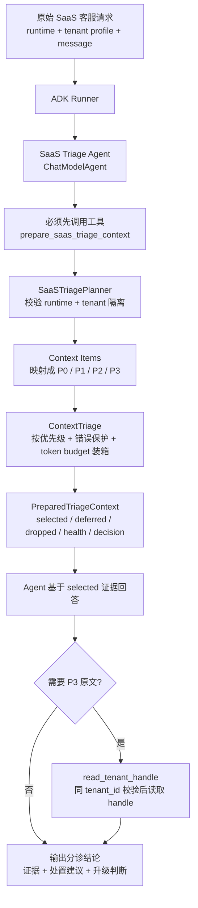

# 多租户 SaaS 客服分诊 Agent

这个包实现的是 Context Triage 模式：原始客服请求先进入 ADK Agent，由 Agent 调用工具完成上下文分诊，再基于被选中的证据回答。

核心 Agent 流程：



记忆点：这个模式不是在外部 helper 里先替 Agent 做感知和分类；raw 请求先进入 ADK loop，Agent 必须通过 `prepare_saas_triage_context` 得到可用上下文。P0/P1/P2 才能直接进回答，P3 默认只暴露租户级 handle，需要时再用 `read_tenant_handle` 同租户读取。

命令入口：

```bash
env CMD_E2E=1 GOCACHE=/private/tmp/ai-designing-gocache go test ./cmd/triage-agent -run TestTriageAgentEndToEnd -count=1 -v
```
