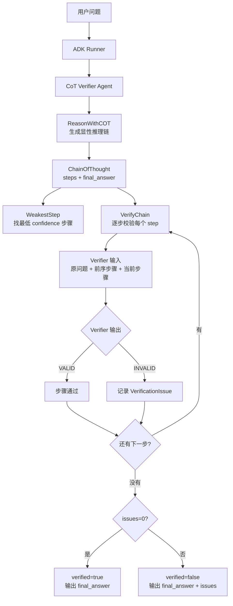

# Chain-of-Thought Verifier Agent

这个包是一个线性 CoT 校验模式：先生成可审计的显性推理步骤，再逐步校验每一步是否被原问题和前序步骤支持。

核心 Agent 流程：



记忆点：这个模式不是直接相信第一轮推理链，而是把 `steps` 拆开逐步复核；每一步都必须能被“原问题 + 前序步骤”支撑，否则进入 `issues`。

命令入口：

```bash
go run ./cmd/cot-verifier-agent -prepare-only
go run ./cmd/cot-verifier-agent -json
```
