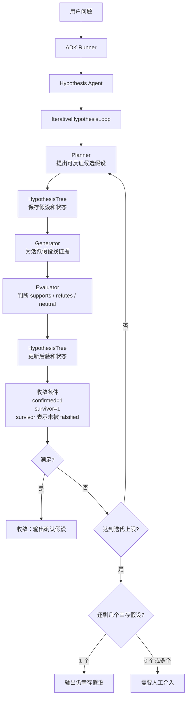

# Iterative Hypothesis Agent

这个包是 `reasoning/d-iterative-hypothesis/pattern.py` 的 Go + Eino ADK 翻译版。

核心结构：

- `Hypothesis`：单个候选解释，包含先验、后验、状态和证据轨迹。
- `HypothesisTree`：保存本轮问题的假设集合，并按“未被反证的幸存假设”判断收敛。
- `IterativeHypothesisLoop`：执行 planner -> generator -> evaluator 循环，直到唯一确认假设幸存或达到迭代上限。

核心 Agent 流程：



记忆点：这个模式不是让模型直接给答案，而是先把可能解释并列放进 `HypothesisTree`，再用证据逐轮反证；最终只相信“唯一没有被反证、且已被确认”的幸存假设。

命令入口：

```bash
go run ./cmd/hypothesis-agent -prepare-only
go run ./cmd/hypothesis-agent -json
```

默认场景是社区活动报名下滑诊断，属于非 coding 的现实根因分析任务。
